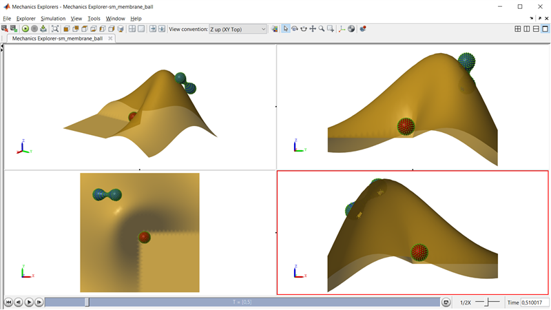

# **Multibody Contact Force Block Examples in Simscape Multibody&trade;**
Copyright 2023 The MathWorks, Inc.

This repository contains a set of examples that demonstrate the 
[Spatial Contact Force block](https://www.mathworks.com/help/sm/ref/spatialcontactforce.html) 
and [Planar Contact Force block](https://www.mathworks.com/help/sm/ref/planarcontactforce.html) 
The examples cover:
* **Solid-to-solid contact** between parameterized solids like bricks, spheres, and cylinders
* **Contact between CAD geometry** including STEP files.
* **[Point Cloud](https://www.mathworks.com/help/sm/ref/pointcloud.html) definition** for efficient contact modeling of complex shapes.
* **[Grid Surface](https://www.mathworks.com/help/sm/ref/gridsurface.html) modeling** for efficient contact modeling with terrain.
* **Custom force law definition** including collision and friction forces.
* **Point cloud definition** to evenly distribute points over areas and volume surfaces.
* **Convex hull visualization** by generating an STL of the hull for points and STL geometry.

Open the project file Spatial_Contact_Force_Examples.prj to get started.

View on File Exchange:   
You can also open in MATLAB Online: 

To learn more about contact modeling with Simscape Multibody, please visit:
* [Modeling Contact Force Between Two Solids](https://www.mathworks.com/help/physmod/sm/ug/modeling-contact-force-between-two-solids.html)
* [Use Contact Proxies to Simulate Contact](https://www.mathworks.com/help/physmod/sm/ug/use-contact-proxies.html)

* Product Capabilities:
   * [Simscape&trade;](https://www.mathworks.com/products/simscape.html)
   * [Simscape Battery&trade;](https://www.mathworks.com/products/simscape-battery.html)
   * [Simscape Driveline&trade;](https://www.mathworks.com/products/simscape-driveline.html)
   * [Simscape Electrical&trade;](https://www.mathworks.com/products/simscape-electrical.html)
   * [Simscape Fluids&trade;](https://www.mathworks.com/products/simscape-fluids.html)
   * [Simscape Multibody&trade;](https://www.mathworks.com/products/simscape-multibody.html)

This submission uses the [S^2 Sampling Toolbox](https://www.mathworks.com/matlabcentral/fileexchange/37004-suite-of-functions-to-perform-uniform-sampling-of-a-sphere)
Anton Semechko (2022). Suite of functions to perform uniform sampling of a sphere (https://github.com/AntonSemechko/S2-Sampling-Toolbox), GitHub. Retrieved March 24, 2022.